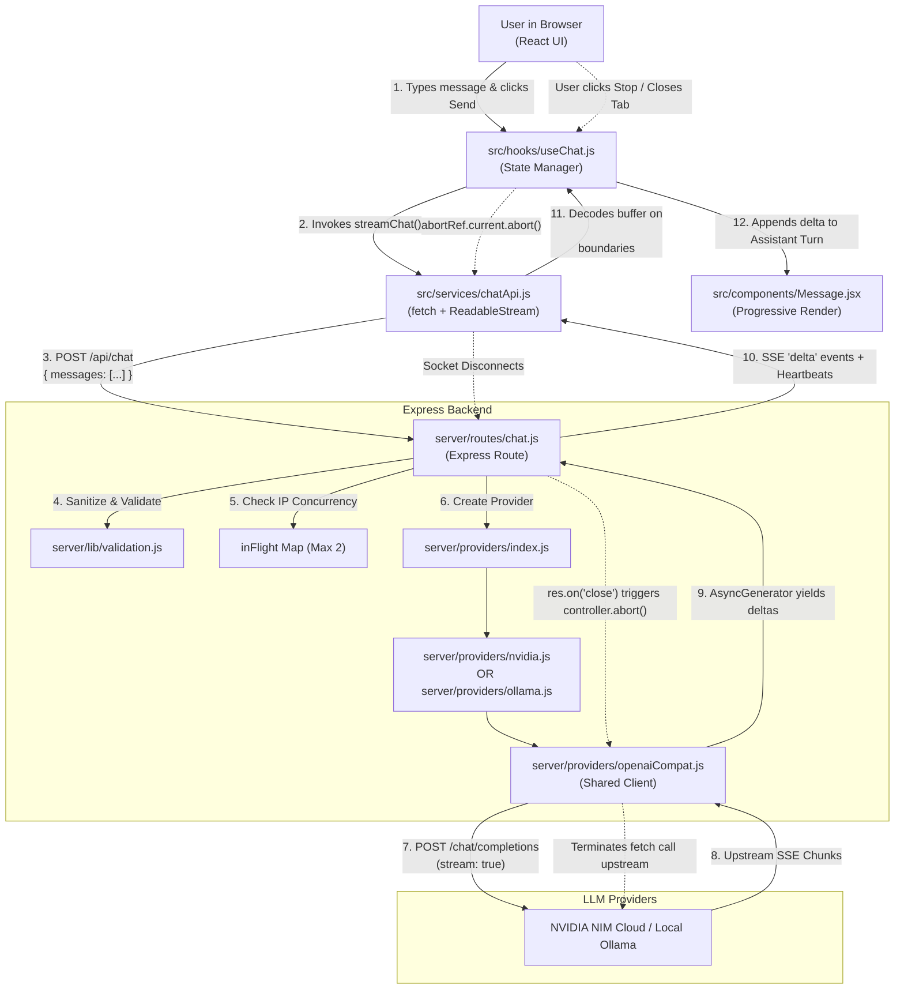

# Nimbus — Complete Codebase Explanation & Meeting Presentation Guide

**Purpose**: This document provides an exhaustive, file-by-file, module-by-module, and line-by-line breakdown of the **Nimbus Chat** application. It explains how all files connect, why architectural decisions were made, and how data flows through the system from the browser down to LLM providers. Use this guide during your presentations or technical interviews to explain the codebase with complete confidence as if you wrote every single line yourself.

---

## 1. Project Overview & Tech Stack

**Nimbus Chat** is a production-grade, minimal, full-stack AI chat application designed to demonstrate the real-world pattern of integrating Large Language Models into a web interface.

### The Problem It Solves
1. **Security**: Many tutorial projects call OpenAI or cloud providers directly from the browser using a client-side API key. That leaks credentials to the public. Nimbus uses an Express API proxy so credentials stay strictly on the server in `.env`.
2. **Streaming & UX**: LLMs take seconds to generate paragraphs. Buffering the entire response results in a terrible user experience. Nimbus streams tokens in real-time using Server-Sent Events (SSE) and native Web Streams.
3. **Upstream Cost & Compute Protection**: If a user navigates away or clicks "Stop", standard frontends leave the upstream LLM running. Nimbus detects connection drops and aborts the upstream request immediately, saving API costs and GPU cycles.
4. **Provider Agnostic**: Easily swaps between hosted cloud models (NVIDIA NIM) and local offline runtimes (Ollama) without modifying a single line of frontend code.

### Core Technologies
- **Frontend Core**: React 18, Vite 5.
- **Styling**: Handcrafted CSS Custom Properties (Design Tokens) — zero heavy CSS frameworks like Tailwind; includes dark/light modes, accessible focus states, and reduced-motion support.
- **Markdown & Code Rendering**: `react-markdown` + `remark-gfm` (strictly without `rehype-raw` to guarantee immunity to XSS prompt injection).
- **Backend Runtime**: Node.js (v20.6+ utilizing native `fetch`, `AbortController`, and Web Streams) + Express 4.
- **LLM Integrations**: NVIDIA NIM API Catalog (`https://integrate.api.nvidia.com/v1`) & Local Ollama (`http://127.0.0.1:11434/v1`).
- **Automated Testing**: Node.js built-in test runner (`node:test`) — 45 tests with zero external test dependencies.

---

## 2. Global Architecture & Data Flow Diagram



---

## 3. Directory Structure & File Relationships

```
nimbus-chat/
├── .env                       # Local secrets (NVIDIA_API_KEY, LLM_PROVIDER)
├── .env.example               # Documented template for environment setup
├── DESIGN.md                  # Design tokens specification (colors, spacing, typography)
├── index.html                 # Single page root with pre-paint theme script
├── package.json               # Node dependencies and npm scripts
├── vite.config.js             # Vite config with React plugin and /api proxy
├── server/
│   ├── index.js               # Server entry point: loads config, listens on port
│   ├── app.js                 # Express app factory (isolated for testing)
│   ├── config.js              # Centralized environment parsing & auto-detection
│   ├── routes/
│   │   └── chat.js            # POST /api/chat: concurrency guard, SSE pipeline, abort listener
│   ├── lib/
│   │   ├── validation.js      # Strict message schema & length boundary validator
│   │   ├── errors.js          # AppError class and sanitized user-safe error dictionary
│   │   └── sse.js             # SSE headers writer, event formatter, and 15s heartbeat
│   └── providers/
│       ├── index.js           # Provider registry & factory interface
│       ├── openaiCompat.js    # Shared OpenAI-compatible streaming engine & SSE parser
│       ├── nvidia.js          # NVIDIA NIM adapter
│       └── ollama.js          # Local Ollama adapter
├── src/
│   ├── main.jsx               # React DOM root render with StrictMode
│   ├── App.jsx                # Top-level component: routing, layout, and event wiring
│   ├── index.css              # Handcrafted CSS custom properties design system
│   ├── constants/
│   │   └── prompts.js         # Starter suggestion cards for empty state
│   ├── hooks/
│   │   ├── useChat.js         # Primary state hub: history, streaming loop, concurrency guards
│   │   └── useTheme.js        # Dark/light theme switcher with localStorage sync
│   ├── services/
│   │   └── chatApi.js         # Single source of truth for browser-to-server HTTP/SSE calls
│   └── components/
│       ├── Header.jsx         # App header, model indicator chip, theme switch, new chat
│       ├── ChatWindow.jsx     # Handles switching between EmptyState and MessageList
│       ├── EmptyState.jsx     # Greeting headline and 4 clickable starter prompts
│       ├── MessageList.jsx    # Scroll container with intelligent stick-to-bottom pinning
│       ├── Message.jsx        # Individual turn: user bubble vs markdown assistant response
│       ├── ChatInput.jsx      # Auto-expanding composer textarea with keyboard navigation
│       ├── CopyButton.jsx     # Clipboard copy button with temporary visual feedback
│       ├── ErrorBanner.jsx    # Dismissible error alert with translated human messages
│       └── About.jsx          # Architecture explainer page with live provider info
└── test/                      # 45 unit & route tests (runs via node --test)
```

---

## 4. Frontend Deep-Dive (File by File & Line by Line)

### 4.1 `index.html` — Zero-FOUC Shell
- **Lines 10–28 (Theme Bootstrapping Script)**:
  An inline, synchronous JavaScript IIFE executes in `<head>` before the browser paints the DOM. It checks `localStorage.getItem('nimbus.theme')` and falls back to `window.matchMedia('(prefers-color-scheme: light)')`. It sets `document.documentElement.dataset.theme = theme` immediately.
  *Why this matters*: Prevents **FOUC (Flash of Unstyled Content)**. Without this, dark mode users would experience a white flash while React initializes.
- **Line 31**: `<div id="root"></div>` where React mounts.

### 4.2 `src/main.jsx` — React Initialization
- **Lines 6–10**: Uses `createRoot` with React 18's `StrictMode` to catch lifecycle side-effects and render `App.jsx`.

### 4.3 `src/App.jsx` — Top-Level Orchestrator
- **Lines 23–35**: Consumes custom hooks `useTheme()` and `useChat()`.
- **Lines 37–59**: Lightweight Client-side Routing:
  Manages a `path` state synced to `window.location.pathname`. Listens to the browser's `popstate` event so browser Back/Forward buttons work without bringing in external dependencies like React Router.
- **Lines 40–48**: Calls `fetchMeta()` on initial mount to retrieve provider name, model, and character limits from `/api/meta`.
- **Lines 70–103**: Layout structure:
  - Accessible `#composer-input` skip link for keyboard/screen-reader users.
  - `<Header>` with model chip and navigation.
  - `<ErrorBanner>` rendered conditionally if an error is present.
  - Main container rendering `<About>` if route is `/about`, or `<ChatWindow>` + `<ChatInput>` on `/`.

### 4.4 `src/hooks/useChat.js` — The Core State Machine
This is the heart of the frontend application.
- **Lines 24–30 (State Variables)**:
  - `messages`: Array of message objects `{ id, role, content }`.
  - `input`: Current composer text.
  - `isGenerating`: Boolean flag indicating an in-flight LLM stream.
  - `error`: Structured error object `{ code, message }`.
  - `cooldownUntil`: Epoch timestamp used when a 429 rate limit is encountered.
- **Lines 31–33 (Refs)**:
  - `messagesRef`: Mirror of `messages` to prevent stale closure bugs in asynchronous stream loops.
  - `abortRef`: Stores the active `AbortController` instance.
  - `inFlightRef`: Synchronous boolean flag to immediately block duplicate submissions before React state can even trigger a re-render.
- **Lines 58–127 (`send()` Function)**:
  1. Trims text and validates non-emptiness.
  2. Checks `inFlightRef.current` and `cooldownUntil` guards.
  3. Appends user message and an empty assistant message placeholder (`content: ''`).
  4. Creates a new `AbortController` and stores it in `abortRef`.
  5. Calls `streamChat()`: on every delta received, it updates the assistant message incrementally (`content + delta`).
  6. **Catch block**: If error code is `'aborted'`, retains partial text received so far; otherwise sets error banner and drops empty placeholder. If rate-limited, sets a 15-second cooldown.
- **Lines 129–141 (`stop()` & `newChat()`)**:
  - `stop()` calls `abortRef.current?.abort()`.
  - `newChat()` aborts active streams, resets message arrays, clears errors, and resets the composer.

### 4.5 `src/hooks/useTheme.js` — Theme State & Persistence
- **Lines 5–10 (`readInitialTheme`)**: Checks `localStorage` then falls back to OS prefers-color-scheme.
- **Lines 19–26**: `useEffect` updates `document.documentElement.dataset.theme` and writes to `localStorage` safely inside a `try/catch` (handles private browsing storage restrictions).

### 4.6 `src/services/chatApi.js` — SSE Streaming Network Client
- **Lines 10–17 (`ChatApiError`)**: Custom error class preserving error code, human message, and HTTP status.
- **Lines 32–42 (`readSseBlock`)**: Parses raw text blocks split by `\n\n`. Ignores lines starting with `:` (SSE heartbeat comments), and extracts `event:` and `data:`.
- **Lines 54–114 (`streamChat`)**:
  1. Makes a `fetch('/api/chat')` with `POST` and `Accept: text/event-stream`.
  2. Validates `response.ok` (if false, parses backend JSON error).
  3. Obtains `response.body.getReader()`.
  4. Runs an infinite loop `reader.read()`, feeding byte chunks into a `TextDecoder`.
  5. Buffers chunks and splits on `\n\n` event boundaries.
  6. Dispatches `delta` to `onDelta(data.delta)`, `done` to `onDone(data)`, and throws on `error`.
  7. Wraps reader cleanup in `finally { reader.cancel?.().catch(() => {}) }`.

### 4.7 Component Breakdown
- **`Header.jsx`**: Renders the application brand, model status badge (`modelLabel`), theme toggle button, and "New Chat" button (disabled when `messages.length === 0`).
- **`ChatWindow.jsx`**: Switches between `<EmptyState>` and `<MessageList>`. Renders a hidden `aria-live="polite"` element for screen-reader status announcements.
- **`EmptyState.jsx`**: Displays starter prompt cards. Clicking any card calls `onSelectPrompt(example.prompt)` directly, initiating generation.
- **`MessageList.jsx`**: Scroll viewport. Calculates `scrollHeight - scrollTop - clientHeight`. If distance from bottom is $< 120\text{px}$, `stickRef.current` remains `true` and automatically scrolls down on new tokens. If the user scrolls up to read earlier responses, auto-scrolling is paused.
- **`Message.jsx`**: Renders conversation turns.
  - User turns: rendered as plain text inside styled bubbles.
  - Assistant turns: rendered via `<ReactMarkdown remarkPlugins={[remarkGfm]}>`. Features an animated pulsing caret (`.caret`) during active streaming. Once finished, renders the `<CopyButton>`.
- **`ChatInput.jsx`**: Auto-resizing textarea. Dynamic calculation of `element.scrollHeight` up to 220px. Handles `Enter` to send, `Shift+Enter` for newline, and checks `!event.nativeEvent.isComposing` to prevent accidental submissions during IME character composition. Toggles between Send and Stop buttons.
- **`CopyButton.jsx`**: Copies text via `navigator.clipboard.writeText(text)` and toggles label to "Copied" for 1500ms.
- **`ErrorBanner.jsx`**: Displays server errors with mapped human descriptions (`CODE_LABELS`) and a dismiss button.
- **`About.jsx`**: In-app documentation view detailing the architecture and active provider.

---

## 5. Backend Deep-Dive (File by File & Line by Line)

### 5.1 `server/index.js` — Process Entrypoint
- Loads configuration via `./config.js`.
- Calls `createApp(config)` and binds to `config.port` (default 3001).
- Logs startup information (active provider, model name, environment).
- Hooks into process signals `SIGINT` and `SIGTERM` to perform graceful server shutdowns.

### 5.2 `server/app.js` — Express Factory
- **Decoupled Architecture**: Factory pattern `createApp(config)` separates application creation from `.listen()`, allowing unit and integration tests to run without binding network ports.
- **Security & Middleware**:
  - `app.disable('x-powered-by')`: Removes tech fingerprinting header.
  - `app.set('trust proxy', true)`: Enables accurate IP tracking behind reverse proxies.
  - `express.json({ limit: config.limits.maxBodyBytes })`: Enforces a 256KB request body limit.
- **Routes**:
  - `GET /api/meta`: Returns safe public configuration (provider ID, model name, character limits). Never exposes keys or upstream URLs.
  - `GET /api/health`: Health-check endpoint.
  - `app.use('/api/chat', createChatRouter(config))`: Mounts the chat router.
  - Production static serving: In production, serves `dist/` and falls back to `index.html` for client routing.
- **Global Error Handler**: Catches malformed JSON (`entity.parse.failed`) and payload-too-large errors (`entity.too.large`), returning clean 400 and 413 JSON responses.

### 5.3 `server/config.js` — Configuration & Auto-Detection
- Single point of contact for `dotenv` and `process.env`.
- **Auto-Detection Logic**:
  ```js
  const hasNvidiaKey = Boolean(String(env.NVIDIA_API_KEY ?? '').trim());
  const provider = requested || (hasNvidiaKey ? 'nvidia' : 'ollama');
  ```
  If no provider is explicitly requested, it checks for an NVIDIA API key; if missing, it seamlessly defaults to local Ollama.
- Enforces strict integer parsing (`asInt`) on message caps, context caps, and timeout limits.

### 5.4 `server/lib/validation.js` — Input Validation Pipeline
Every request to `POST /api/chat` passes through `validateChatRequest(body, limits)`:
1. Verifies body is an object and `messages` is a non-empty array.
2. Checks total message count against `limits.maxMessages` (40).
3. Verifies each message has a valid role: strictly `'user'` or `'assistant'` (rejects `'system'` so clients cannot override system prompts).
4. Validates that message content is a non-empty string under `limits.maxMessageChars` (8,000 characters).
5. Computes total conversation character length and validates against `limits.maxContextChars` (24,000 characters).
6. **Integrity Rule**: Ensures the last message has role `'user'`.

### 5.5 `server/routes/chat.js` — The Streaming Engine
- **Per-Client Concurrency Guard (Lines 24–54)**:
  Tracks active streams in an `inFlight` Map keyed by client IP (`clientKey`). Allows a maximum of 2 concurrent generations per IP, returning HTTP 429 if exceeded. Prevents abuse and quota exhaustion.
- **SSE Setup (`streamResponse`)**:
  Calls `openEventStream(res)` to set `text/event-stream`, `no-cache`, and `X-Accel-Buffering: no`.
- **Heartbeat (Line 88)**:
  `startHeartbeat(res)` sends `: keep-alive\n\n` comments every 15 seconds. This prevents timeouts from proxies, load balancers, or Cloudflare while waiting for local models to think.
- **Client Disconnect Listener (Lines 71–85)**:
  ```js
  res.on('close', () => {
    if (!res.writableEnded) {
      clientGone = true;
      controller.abort();
    }
  });
  ```
  When a user closes the browser or clicks "Stop", Express detects socket closure and triggers `controller.abort()`.
- **Async Streaming Loop (Lines 96–107)**:
  Iterates over `provider.streamChat(providerMessages, { signal })`, pushing `event: delta` for each chunk. On completion, writes `event: done` with total latency metrics.
- **Error Handling**: Formats errors via `describeError()` and transmits an `event: error` SSE event before ending the stream.

### 5.6 `server/lib/errors.js` — Sanitized Error Management
- Defines `ErrorCodes`: `bad_request`, `missing_api_key`, `invalid_api_key`, `rate_limited`, `model_not_found`, `provider_unavailable`, `network_error`, `stream_interrupted`, `aborted`, `unknown`.
- Maps internal errors into safe, user-friendly sentences.
- **Security Rule**: Raw provider stack traces, secret keys, and upstream response bodies are logged on the server console but are strictly sanitized before reaching the browser.

### 5.7 `server/lib/sse.js` — SSE Formatting Helpers
- `openEventStream(res)`: Flushes standard SSE response headers.
- `sendEvent(res, event, data)`: Writes properly formatted SSE chunks:
  `event: ${event}\ndata: ${JSON.stringify(data)}\n\n`.
- `startHeartbeat(res)`: Recurring 15-second timer writing `: keep-alive\n\n`.

### 5.8 `server/providers/` — The Provider Abstraction Layer
- **`index.js`**: Enforces the provider interface contract:
  `{ id, label, model, streamChat(messages, { signal }): AsyncGenerator<string> }`.
- **`openaiCompat.js`**: Shared streaming engine:
  - Both NVIDIA NIM and Ollama implement OpenAI-compatible endpoints (`POST /chat/completions` with `stream: true`).
  - Implements an async generator `parseSseStream(body)` that parses incoming byte streams.
  - Extracts text deltas via `readChunkText(json)`.
  - Maps upstream HTTP statuses (401 $\rightarrow$ `invalid_api_key`, 429 $\rightarrow$ `rate_limited`, 404 $\rightarrow$ `model_not_found`).
  - Propagates cancellation signals and timeouts (`timeoutMs`).
- **`nvidia.js`**: Connects to `https://integrate.api.nvidia.com/v1` with Bearer auth. Lazy-checks API key existence on first request.
- **`ollama.js`**: Connects to `http://127.0.0.1:11434/v1` with zero authentication. Provides clear guidance if Ollama is not running.

---

## 6. How to Present This Codebase in a Meeting

Follow this structured presentation flow:

```
1. Problem & Architecture (2 mins)
   └── Why an Express proxy is required over direct browser calls (Security + Streaming + Cancellation)

2. Live Demonstration (3 mins)
   ├── Stream a response & point out the smooth token-by-token rendering
   ├── Click "Stop" to show immediate cancellation
   ├── Toggle Dark/Light mode (zero visual flash)
   └── Inspect the Network tab: show SSE stream and absence of leaked API keys

3. Technical Deep-Dive (5 mins)
   ├── Frontend: useChat state machine & smart stick-to-bottom scroll logic
   ├── Backend: Validation rules & per-IP concurrency throttling
   └── Provider Layer: AsyncGenerator interface supporting NVIDIA NIM and Ollama

4. Production Readiness & Testing (2 mins)
   └── Highlight 45 automated unit/route tests run via native node:test
```

---

## 7. Technical Questions & Prepared Senior-Level Answers

### Q1: Why did you build a custom proxy instead of calling the LLM directly from React?
**Answer**: *"Security and control. If you call an LLM from the browser, your API key must be bundled into client-side JavaScript, which anyone can inspect and steal. By routing through an Express proxy, credentials stay securely in `.env`. Additionally, the backend lets us enforce rate limits, validate message lengths, inject a tamper-proof system prompt, and abort expensive upstream requests when users disconnect."*

### Q2: Why did you use `fetch` with `ReadableStream` instead of the browser's native `EventSource`?
**Answer**: *"The browser's native `EventSource` API only supports `GET` requests and cannot send request bodies or custom headers without complex URL hacks. Chat completions require sending full conversation histories via `POST` with a JSON payload. Using `fetch` with `ReadableStream` gives us full control over `POST` requests while allowing us to parse the Server-Sent Events stream chunk by chunk."*

### Q3: How does request cancellation work end-to-end?
**Answer**: *"It's a cascading abort chain:
1. When the user clicks 'Stop' or closes the tab, React calls `abortRef.current.abort()`.
2. The browser's `fetch` request cancels and the TCP socket closes.
3. On the backend, Express detects this via `res.on('close')`.
4. Our route calls `controller.abort()`, which terminates the upstream `fetch` connection to NVIDIA or Ollama.
This stops token generation immediately and saves GPU compute and API token billing."*

### Q4: How do you handle auto-scrolling during streaming without annoying the user?
**Answer**: *"In `MessageList.jsx`, we calculate the user's distance from the bottom: `scrollHeight - scrollTop - clientHeight`. If that distance is under 120 pixels, we keep `stickRef.current` set to `true` and auto-scroll as new tokens arrive. But if the user scrolls up to re-read an earlier message, `stickRef.current` becomes `false`, pausing auto-scroll so the user's view isn't yanked downward mid-read."*

### Q5: How do you prevent XSS vulnerabilities from LLM output?
**Answer**: *"LLM output is untrusted data. We use `react-markdown` with GitHub Flavored Markdown (`remark-gfm`), but we explicitly do **not** configure raw HTML parsers like `rehype-raw`. If a malicious prompt injection causes the model to output `<script>` or HTML event handlers, it is safely rendered as inert text rather than executed."*

### Q6: How easy is it to add a new provider, like Anthropic Claude or Google Gemini?
**Answer**: *"Very easy because of the provider adapter pattern in `server/providers/index.js`. Any provider only needs to implement an object with `id`, `label`, `model`, and an async generator `streamChat(messages, { signal })`. You create a new provider file, register it in the `FACTORIES` map, and you can switch to it with a single `.env` change without altering any route or UI code."*
